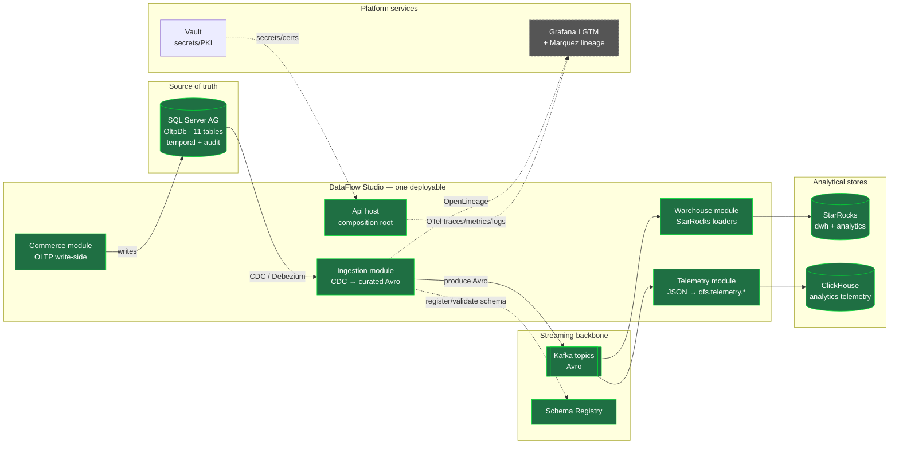
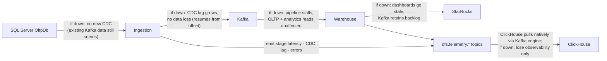
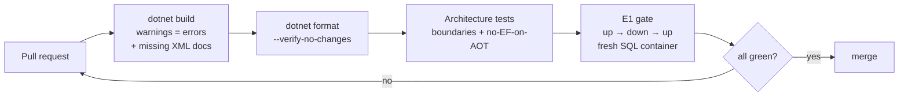

# DataFlow Studio — Architecture

> **Read this first.** This document is the map of the whole system: *what* we are building, *why*
> it is shaped this way, *how* it is used, and *how each part affects the others*. Every diagram
> renders natively on GitHub (Mermaid). It is kept current every iteration.

---

## 1. What we are building — and why

DataFlow Studio is a **change-data-capture (CDC) pipeline**. It takes every change made to a
transactional commerce database and delivers it, in near-real-time, into analytical stores — so
analysts get fresh dashboards **without ever querying (and slowing down) the transactional system**.

That single idea drives every design choice:

| We need to… | …so we do this | Why |
|---|---|---|
| Not slow down the OLTP database | Read changes via **CDC**, not by querying tables | CDC reads the transaction log, not the live tables — zero contention with the app. |
| Decouple producers from consumers | Put a **Kafka** log between them | The warehouse can be down/slow without back-pressuring the OLTP source; multiple consumers replay independently. |
| Keep messages self-describing + evolvable | Serialize as **Avro** via **Schema Registry** | Producers and consumers agree on schema; schema changes are validated, not guessed. |
| Serve analytics fast | Load into a **StarRocks** Kimball star schema | Columnar MPP warehouse purpose-built for aggregation; SCD2 dimensions preserve history. |
| Know the pipeline's own health | Write telemetry to **ClickHouse** | CDC lag, per-stage latency, and errors are themselves high-volume time-series — ClickHouse's home turf. |
| Ship one thing, keep clean seams | A **modular monolith** | One deployable to build/run/demo, but module boundaries enforced by tests so it can later split into services. |

---

## 2. System context — DataFlow Studio and the world around it

Everything outside the dashed box is **NexusPlatform lab infrastructure** that DataFlow Studio
*consumes* (it does not own or provision it).



> **Legend — build status (end of Week 3e):** green = built, tested and **live on the lab**;
> grey-dashed = still to come. The whole data path is green — OltpDb → CDC/Debezium → Kafka+Schema
> Registry → the StarRocks Kimball star, and ClickHouse ingesting the pipeline's own telemetry
> natively. The **observability leg is now green too**: OpenTelemetry OTLP export sends per-stage
> spans to Tempo and metrics to Prometheus (Grafana LGTM, Phase 0.I; ADR-0010). Only the OpenLineage →
> Marquez lineage leg (Week 3f) remains.

---

## 3. Inside the monolith — modules and their allowed dependencies

The core architectural rule: **modules never reference each other.** They depend only on the
`SharedKernel`, and only the `Api` composition root references the modules. These arrows are the
*only* dependencies allowed — [`ArchitectureTests`](../tests/DataFlowStudio.Architecture.Tests/ArchitectureTests.cs)
fails the build if any other edge appears.

```mermaid
flowchart TD
    API[DataFlowStudio.Api<br/><i>composition root</i>]
    COM[Modules.Commerce]
    ING[Modules.Ingestion<br/><i>non-AOT (ADR-0007) · no EF Core</i>]
    WH[Modules.Warehouse]
    TEL[Modules.Telemetry]
    SK[SharedKernel<br/><i>Result · AuditColumns · IModule<br/>IntegrationEvent · telemetry contracts</i>]
    MIG[Migrations.Oltp<br/><i>FluentMigrator · deploy-time tool</i>]

    API --> COM
    API --> ING
    API --> WH
    API --> TEL
    COM --> SK
    ING --> SK
    WH --> SK
    TEL --> SK
    API --> SK

    MIG -.->|standalone tool,<br/>owns OltpDb schema| API

    classDef mod fill:#24405c,stroke:#5b9,color:#fff;
    classDef root fill:#3a2c5c,stroke:#a7f,color:#fff;
    classDef kernel fill:#1f6f43,stroke:#0d3,color:#fff;
    class COM,ING,WH,TEL mod;
    class API root;
    class SK,MIG kernel;
```

**Why this shape:**
- **SharedKernel is the only coupling surface.** Cross-module data travels as an
  `IntegrationEvent` (a SharedKernel type), so the Ingestion worker can serialize *any* module's
  changes without referencing that module. That is what keeps the modules independent.
- **The Api is the only integrator.** It instantiates each module explicitly (no reflection) and
  lets it self-register via `IModule.RegisterServices`. One place wires everything → predictable
  startup, trim/AOT-friendly.
- **The migration tools stand apart.** Three deploy-time tools own their store's schema and never
  pollute the runtime paths (all raw SQL, no EF Core): `Migrations.Oltp` (FluentMigrator, reversible
  `up → down → up`); `Migrations.Starrocks` (DbUp over MySqlConnector, forward-only) for the `dwh`
  star; and `Migrations.Clickhouse` (a DbUp-pattern runner over `ClickHouse.Client`, forward-only)
  for the `analytics` telemetry schema. The two sink migrations gate on `apply → re-apply`
  idempotency against throwaway containers (ADR-0005).

| Module | Owns | Talks to | Status |
|---|---|---|---|
| **Commerce** | OLTP write-side over `OltpDb` (source of truth) | SQL Server (Dapper) | domain types real; write-side Week 2 |
| **Ingestion** | CDC curation: raw Debezium → curated Avro, data-driven catalog (non-AOT, no EF) | Kafka (raw + curated), Schema Registry | all 10 order-flow entities (3B; ADR-0007) |
| **Warehouse** | StarRocks Kimball DWH loaders (SCD2 dims + facts) | Kafka (consume curated), StarRocks (MySQL wire) | loaded (3C; ADR-0006) |
| **Telemetry** | Pipeline self-observation: stage latency, CDC lag, errors; OTLP traces + metrics export | Kafka (produce `dfs.telemetry.*`), ClickHouse (HTTPS control path), OTel collector (OTLP) | live (3D ADR-0008; OTLP 3E.2 ADR-0010) |

> **The telemetry seam.** The Ingestion and Warehouse engines emit through
> `IPipelineTelemetrySink` — a SharedKernel contract — so neither references the Telemetry module and
> module isolation holds. The concrete sink produces JSON to Kafka, and **ClickHouse ingests it
> natively** via Kafka-engine tables + materialized views; no .NET consumer sits on that path. A
> second, non-duplicating path inserts errors straight over ClickHouse HTTPS when the broker is
> unreachable. The shared `DataFlowStudio.Clickhouse` library owns the private-CA TLS connection
> factory used by both the Telemetry module and the migrations tool (ADR-0008).

---

## 4. How a single row travels the whole system

The end-to-end path of one order placement — the "single row traverses everything" demo.

```mermaid
sequenceDiagram
    autonumber
    participant App as Commerce (OLTP write)
    participant SQL as SQL Server OltpDb
    participant CDC as Ingestion worker (curation)
    participant SR as Schema Registry
    participant K as Kafka (Avro)
    participant WH as Warehouse loader
    participant STAR as StarRocks dwh
    participant TEL as Telemetry writer
    participant CH as ClickHouse

    App->>SQL: INSERT dbo.Orders (+ audit cols, ROWVERSION)
    Note over SQL: change lands in the transaction log
    CDC->>SQL: poll cdc.fn_cdc_get_all_changes_*
    CDC->>SR: ensure/validate Avro schema (oltp.orders)
    CDC->>K: produce Avro record (key = OrderId)
    par Warehouse leg
        WH->>K: consume oltp.orders
        WH->>STAR: upsert fact_order + SCD2 dims (MERGE)
    and Telemetry leg
        TEL->>K: consume (observe lag/latency)
        TEL->>CH: write pipeline_events / cdc_lag_seconds
    end
    Note over STAR,CH: analysts query StarRocks; operators watch ClickHouse
```

**What each step guarantees:**
- Steps 1–2: the OLTP write is untouched by the pipeline — CDC reads the log afterward.
- Steps 3–5: the message is schema-validated and durable in Kafka before any consumer runs.
- Steps 6–9: the two legs are **independent consumers** — the warehouse and telemetry can fail,
  restart, or lag independently without losing data (Kafka retains the log).

> **This is live (Week 2).** OltpDb runs on the SQL Server AG with CDC enabled; Debezium streams the
> raw change to Kafka; the .NET curation worker reshapes it to a schema-registered Avro event
> ([ADR-0004](adr/ADR-0004-cdc-transport-debezium-curation.md), [ADR-0003](adr/ADR-0003-avro-schema-registry.md)).
> Run `.\scripts\dfs-trace.ps1` to watch one record traverse all five faces, or follow it by hand via
> [docs/demos/watch-the-pipeline.md](demos/watch-the-pipeline.md).

---

## 5. How each system affects the others (coupling & blast radius)

Understanding failure propagation is the point of decoupling. "Affects" = if the **From** system
degrades, what happens to the **To** system.



| If this degrades… | Immediate effect | Protected by |
|---|---|---|
| **SQL Server (source)** | No new changes captured; already-streamed data keeps serving analytics | SQL AG failover (lab HA); CDC resumes from its last LSN |
| **Ingestion worker** | CDC lag grows; **no data loss** | Kafka consumer offsets — it resumes exactly where it stopped |
| **Kafka** | Whole pipeline pauses; OLTP writes and existing analytics reads **unaffected** | Kafka is HA (RF=3, mTLS); it's a buffer, not a coupler |
| **Warehouse loader / StarRocks** | Dashboards go stale; **Kafka retains the backlog** | Replay from Kafka once recovered |
| **Telemetry / ClickHouse** | Lose pipeline observability; **data flow unaffected** | Telemetry is a side-channel, never on the data path. Emission is fire-and-forget and every record call is exception-guarded, so a broker or ClickHouse outage cannot stall curation or the DWH load; ClickHouse resumes from its consumer-group offset when it returns |

The load-bearing idea: **Kafka is a shock absorber.** Nothing upstream blocks on anything
downstream. That is why CDC + a log broker, rather than a direct SQL→warehouse ETL, is the design.

---

## 6. Build, test & enforcement

The architecture is not a suggestion — it is enforced so it cannot silently erode:

- **Module boundaries** — `ArchitectureTests` (NetArchTest) fail the build if a module references
  another module or the host, or if an AOT path references EF Core. ([ADR-0001](adr/ADR-0001-modular-monolith.md), [ADR-0002](adr/ADR-0002-dapper-fluentmigrator-on-aot-paths.md))
- **Reversible schema** — the **E1 gate** runs migrations `up → down → up` on a fresh SQL Server in
  CI (Testcontainers) and locally (LocalDB). ([Migrations.Tests](../tests/DataFlowStudio.Migrations.Tests/OltpMigrationUpDownUpTests.cs))
- **Documentation** — `GenerateDocumentationFile` is on for `src`, so every public member without an
  XML `<summary>` is a **CS1591 error** under warnings-as-errors. Undocumented public API cannot
  merge.
- **Warnings are errors** everywhere; `dotnet format --verify-no-changes` gates style in CI.



---

## 7. Where the code lives

```
src/
  DataFlowStudio.Api            composition root (minimal API, OpenAPI, health/modules)
  DataFlowStudio.SharedKernel   Result · Error · AuditColumns · IModule · IntegrationEvent
                                Telemetry/  IPipelineTelemetrySink + telemetry records (pure contracts)
  DataFlowStudio.Clickhouse     shared private-CA TLS connection factory (migrations + Telemetry)
  DataFlowStudio.Migrations.Oltp        FluentMigrator migrations (11 tables) + runner + CLI
  DataFlowStudio.Migrations.Starrocks   DbUp (MySQL wire) — dwh star
  DataFlowStudio.Migrations.Clickhouse  DbUp-pattern runner — analytics telemetry + Kafka ingestion
  Modules/
    Commerce                    OLTP write-side domain + CDC contracts
    Ingestion                   CDC curation: raw Debezium → curated Avro (non-AOT, no EF)
    Warehouse                   StarRocks Kimball loaders (SCD2 dims + facts)
    Telemetry                   Kafka JSON telemetry sink + ClickHouse HTTPS error sink
  DataFlowStudio.{Seed,Curation,WarehouseSink,Trace,Telemetry}   runnable consoles (drain / demo / verify)
tests/
  DataFlowStudio.Architecture.Tests  NetArchTest boundary + no-EF rules
  DataFlowStudio.Migrations.Tests    E1 gates (OltpDb up→down→up; sink idempotency) + profiles
  DataFlowStudio.UnitTests           SharedKernel primitives · curation · sink SQL · telemetry wire
docs/
  architecture.md   this file            adr/   decision records
  sql-showcase.md   advanced SQL         api/   openapi.yaml + asyncapi.yaml
```
